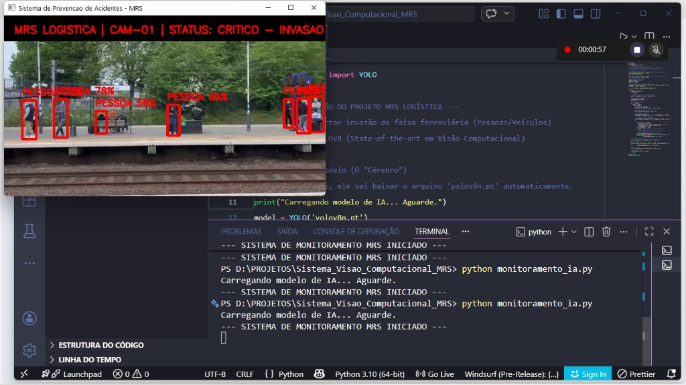

# 👁️ Computer Vision System for Railway Safety (POC)


> **Project developed as a Proof of Concept (POC) to increase operational safety in railway yards and lines..**



## 🎯 Project Objective
To develop a **real-time intelligent monitoring** solution capable of automatically identifying intrusions in high-risk areas (railways and maneuvering zones), without relying solely on human attention.

The system simulates a security camera from **MRS Logística**, detecting people near the tracks and issuing immediate visual alerts to prevent accidents.

## 🛠️ Technologies Used
* **Python 3.10:** Base language for data processing.
* **YOLOv8 (Ultralytics):** State-of-the-art Artificial Intelligence for object detection with high precision and speed.
* **OpenCV:** Video manipulation and graphical interface (HUD) design over the image.
* **Safety Logic:** Algorithm that classifies the risk level (Normal vs. Critical) depending on the object detected on the road.

## 🚀 Features
* ✅ **Human and Vehicle Detection:** Identifies pedestrians, cars, and trucks.

* ✅ **Risk Classification:**
* 🟢 **Green:** Safe area / Normal monitoring.

* 🔴 **Red:** CRITICAL ALERT (Road Intrusion).

* ✅ **Professional HUD:** Visual interface that simulates corporate CCTV systems.

## 💻 How to Run
To run the project, execute the commands below sequentially in your terminal:

```bash
#1. Install Dependencies (AI and Computer Vision)
pip install ultralytics opencv-python

# 2. Rodar o Monitoramento
python monitoramento_ia.py

---
*Desenvolvido por Rômulo | Foco em Soluções Digitais e Segurança Operacional com IA.*
